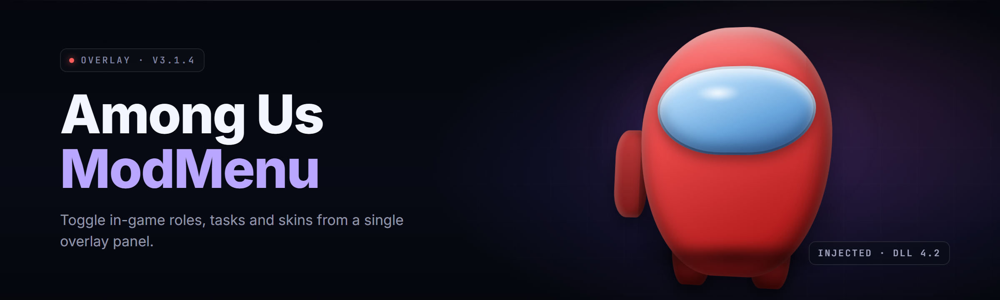

  
  
  

  

  
  

---

**The comprehensive client-side mod menu suite for Among Us: role tools, cosmetic unlocks, host utilities, and quality-of-life overlays — packaged as a single portable `.exe`.**

---

## 🤔 The Problem

Crewmate life in Among Us gets repetitive fast. Vanilla lobbies punish experimentation, cosmetics are gated behind rotations, and hosting a private game usually means scrolling through 40 settings menus before anyone can move.

- 🎭 **Role-locked cosmetics** — you can't preview impostor hats or pets on your own crewmate without paying or grinding.
- 🛠️ **No host sandbox** — changing game speed, role counts, and kill cooldowns requires three separate menus per match.
- 👁️ **Information asymmetry is brutal** — you have no in-game way to check vent positions, task locations, or player paths during practice sessions.
- 🔒 **Friends-only lobbies** lock out the features you actually want to learn (client-side mods, role swaps, practice modes).
- 🐌 **Kill/vent cooldown timing** is guesswork; there's no overlay timer telling you when Abilities are ready.
- 🎨 **Skins & pets rotate out** — you can't equip what you don't own, even in a private lobby with friends.
- 📊 **No post-match analytics** — you finish a game and have zero data on reaction times, deceive rates, or path efficiency.

---

## 📖 What is Among Us ModMenu?

| Term | Explanation |
|---|---|
| **ModMenu** | An in-game overlay menu injected at runtime that exposes client-side toggles for Among Us. |
| **Client-side mod** | A modification applied to your own game instance that does not alter the host's or other players' code. |
| **Host utilities** | Settings that only take effect when *you* are the lobby host — role counts, game speed, task totals. |
| **Overlay** | A transparent layer rendered above the game — this is where timers, ESP boxes, and buttons live. |
| **ESP** | "Extra Sensory Perception" — visual markers showing player positions, task icons, or vent locations. |
| **Injector** | The small launcher that attaches ModMenu to the Among Us process after the game boots. |
| **Cosmetic unlock** | Local-only cosmetics that render for you and (optionally) sync to others if the lobby allows mods. |

**Why players keep it installed:**

- Practice roles privately without needing 9 friends online.
- Preview any hat, skin, pet, or visor combination before spending hours grinding.
- Run host presets so a 10-second lobby setup replaces a 4-minute menu crawl.
- Learn vent routes and task layouts using the training overlay.
- Keep an Abilities timer so you never miss a kill window again.
- Save and share lobby presets (JSON) with your regular squad.

---

## 🧭 Overview

| Category | Details |
|---|---|
| **Client** | Standalone `.exe`, no installer, no dependencies |
| **Game** | Among Us (Steam / Microsoft Store / itch.io builds) |
| **Interface** | `INSERT` toggles overlay — fully rebindable |
| **Modules** | 22 core modules across 6 subsystems |
| **Profiles** | Per-server presets saved to `./profiles/*.json` |
| **Footprint** | ~38 MB extracted; no registry writes |
| **Updates** | Manual — drop the new `.exe` over the old one |
| **Restore** | Delete the folder; nothing else is touched |

ModMenu is a **client-side overlay**. It reads game state and renders UI on top of Among Us; it does not alter the game executable on disk. That means uninstalling is literally "delete this folder," and it means the features you toggle only apply to *your* session unless you're the host — in which case host utilities propagate to the lobby as normal game settings.

---

## ⚖️ Usage Guidelines

| ✅ Allowed | 🚫 Not allowed |
|---|---|
| Private lobbies with consenting friends | Public matchmaking with random players |
| Solo practice / training sessions | Streaming while using overlays designed for private play |
| Hosted mod-enabled lobbies | Using client-side ESP in competitive hosted tournaments |
| Cosmetic preview in your own session | Advertising modded lobbies as vanilla |
| Recording for tutorials with a mods disclaimer | Redistributing ModMenu as your own build |
| Sharing lobby preset JSON files | Selling cosmetics you only unlocked locally |

> **Rule of thumb:** if the other nine players in the lobby don't know ModMenu is running, you're using it wrong. Use it in private games or with a clearly-labeled mods-enabled host.

---

## 🛠️ The Solution

| Problem | Solution |
|---|---|
| Cosmetics you can't preview | **Cosmetic Unlocker** renders any hat/skin/pet/visor locally |
| Host menus buried in submenus | **Host Presets** — swap whole rule sets with one keybind |
| No role practice partner | **Role Sandbox** — spawn any role in a solo lobby |
| No way to see vent maps | **Map Overlay** with vent, task, and console markers |
| Kill cooldown is guesswork | **Ability Timers** overlay with reset-on-use sync |
| Can't analyse your matches | **Session Log** exports a simple JSON of each game |
| Lobbies reset every match | **Profile Manager** — save/load full lobby configs |

---

## 📥 Download & Install

  

1. Visit the project page and download the latest `.exe`.
2. Extract the archive to a folder you control (e.g. `Documents\AmongUsModMenu\`).
3. Launch Among Us normally, then run the ModMenu `.exe`.
4. Press `INSERT` in-game to open the overlay.
5. Configure your profile once — it persists between sessions.

---

## 🧩 Grouped Module Catalog

### 🎭 Cosmetics & Vanity

| Feature | Effect |
|---|---|
| **Hat Unlocker** | Equip any hat regardless of ownership |
| **Skin Rotation** | Cycle through all skins with a hotkey |
| **Pet Preview** | Show any pet on your crewmate in-session |
| **Visor Picker** | Choose any visor colour / pattern |
| **Name Colour** | Set a custom nameplate colour (local) |

### 🕵️ Roles & Abilities

| Feature | Effect |
|---|---|
| **Role Sandbox** | Spawn as impostor/engineer/shapeshifter in solo lobbies |
| **Kill Timer** | Overlay countdown for your kill cooldown |
| **Vent Timer** | Countdown for vent usage when engineer |
| **Shapeshift Tracker** | Highlights your shapeshift form duration |
| **Guardian Angel Range** | Draws a ring for the protect radius |

### 🗺️ Map & Navigation

| Feature | Effect |
|---|---|
| **Vent Overlay** | Marks every vent on the active map |
| **Task Markers** | Floats task icons over task locations |
| **Console Map** | Highlights admin/security consoles |
| **Path Trace** | Draws your recent movement path |
| **Room Labels** | Names rooms on-screen for practice |

### 🏠 Host Utilities

| Feature | Effect |
|---|---|
| **Game Speed Slider** | Adjust speed from 0.5× to 3.0× |
| **Role Count Editor** | Set impostor/neutral counts per lobby size |
| **Task Quantity** | Change common/long/short task totals |
| **Cooldown Presets** | Save kill/vent/use cooldown sets |
| **Emergency Limit** | Toggle unlimited or fixed emergency meetings |

### 👤 Player Overlay

| Feature | Effect |
|---|---|
| **Crewmate ESP** | Outline crewmates when impostor |
| **Impostor ESP** | Outline impostors when crewmate (practice only) |
| **Dead Body Markers** | Mark bodies with a small icon |
| **Colour Index** | On-screen legend of each player's colour |
| **Distance Readout** | Show distance to nearest player |

### ⚙️ System & Profiles

| Feature | Effect |
|---|---|
| **Profile Manager** | Load/save `./profiles/*.json` |
| **Hotkey Editor** | Rebind every overlay toggle |
| **Session Log** | Export match JSON to `./logs/` |
| **Theme Switcher** | Dark, light, and high-contrast overlay themes |
| **Config Backup** | One-click zip of profiles + settings |

---

## ⭐ Key Features

| Feature | Description | Benefit |
|---|---|---|
| **One-Key Overlay** | `INSERT` opens the menu, `END` hides it entirely | Instant access without alt-tab |
| **Zero-Install** | Portable `.exe`, no registry writes | Move between PCs on a USB stick |
| **Preset System** | JSON lobby profiles | Share setups with friends in seconds |
| **Hotkey Everything** | Every module has a bindable key | Play without leaving keyboard |
| **Theme Aware** | Overlay matches Among Us art style | Reads as part of the client |
| **Log Export** | Per-match JSON summary | Post-game review without spreadsheets |
| **Sandbox Mode** | Solo-lobby role swap | Learn roles without needing a group |
| **Map Overlays** | Vent, task, console markers | Faster map learning curve |
| **Ability Timers** | Kill/vent/shift countdowns | Precise timing practice |
| **Cosmetic Preview** | Local-only hat/skin/pet equips | Test loadouts before buying |
| **Config Backup** | Zip export of profiles + settings | Restore in two clicks |
| **Restore Path** | Delete the folder = clean uninstall | No leftover registry keys |

---

## 📑 Table of Contents

- [The Problem](#-the-problem)
- [What is Among Us ModMenu?](#-what-is-among-us-modmenu)
- [Overview](#-overview)
- [Usage Guidelines](#️-usage-guidelines)
- [The Solution](#️-the-solution)
- [Download & Install](#-download--install)
- [Grouped Module Catalog](#-grouped-module-catalog)
- [Key Features](#-key-features)
- [Quick Start](#-quick-start)
- [System Requirements](#-system-requirements)
- [Tips for Best Results](#-tips-for-best-results)
- [All Modules Status](#-all-modules-status)
- [Comparison](#-comparison)
- [Known Issues](#-known-issues)
- [FAQ](#-faq)

---

## 🚀 Quick Start

1. 🎮 **Launch Among Us** and get to the main menu — do not enter a lobby yet.
2. 📦 **Run the ModMenu `.exe`** from its extracted folder. A small tray icon appears.
3. 🔑 **Press `INSERT`** in-game to open the overlay. Default theme loads automatically.
4. 🎛️ **Pick a profile** — start with `practice.json` if you're learning roles.
5. 💾 **Save your setup** via *Profile Manager → Save As* so your next session is one keypress away.

---

## 🖥️ System Requirements

| Component | Minimum | Recommended |
|---|---|---|
| **OS** | Windows 10 64-bit (build 1909+) | Windows 11 22H2+ |
| **CPU** | Dual-core 2.4 GHz | Quad-core 3.0 GHz+ |
| **RAM** | 4 GB | 8 GB |
| **GPU** | Integrated (Intel UHD 620) | Dedicated GPU with 2 GB VRAM |
| **Storage** | 60 MB free | 150 MB free (logs + profiles) |
| **Game** | Among Us (current Steam/itch build) | Same, latest patch |
| **Runtime** | .NET Desktop Runtime 6 | .NET Desktop Runtime 8 |

---

## 💡 Tips for Best Results

- Run Among Us in **Windowed** or **Borderless** mode — the overlay anchors better than exclusive fullscreen.
- Keep your extracted folder **outside** `Program Files` so updates don't trigger UAC prompts.
- Use a **separate profile per map** — vent overlays and task markers behave differently on The Skeld vs. Polus.
- Bind *Toggle All Overlays* to a key you can hit without looking (`F8` is popular).
- Before recording or streaming, disable ESP modules — visuals are meant for your eyes only.
- Back up `./profiles/` weekly; it's a single folder and takes seconds.
- If the overlay feels laggy in a 10-player lobby, drop the **Path Trace** module — it redraws every frame.

---

## 📊 All Modules Status

| Module | Status | Description |
|---|---|---|
| Hat Unlocker | ✅ Working | Local cosmetic equips |
| Skin Rotation | ✅ Working | Hotkey skin cycling |
| Pet Preview | ✅ Working | Any pet, in-session |
| Visor Picker | ✅ Working | Full colour range |
| Name Colour | ✅ Working | Local nameplate tint |
| Role Sandbox | ✅ Working | Solo-lobby role swap |
| Kill Timer | ✅ Working | Overlay countdown |
| Vent Timer | ✅ Working | Engineer cooldown |
| Shapeshift Tracker | ✅ Working | Duration ring |
| Guardian Angel Range | ✅ Working | Protect radius ring |
| Vent Overlay | ✅ Working | Vent markers per map |
| Task Markers | ✅ Working | Floating task icons |
| Console Map | ✅ Working | Admin/security markers |
| Path Trace | ✅ Working | Movement history line |
| Room Labels | ✅ Working | On-screen room names |
| Game Speed Slider | ✅ Working | Host-side adjustment |
| Role Count Editor | ✅ Working | Per-lobby role counts |
| Task Quantity | ✅ Working | Task total editor |
| Cooldown Presets | ✅ Working | Saved cooldown sets |
| Emergency Limit | ✅ Working | Meeting count toggle |
| Crewmate ESP | ✅ Working | Practice-only outline |
| Impostor ESP | ✅ Working | Practice-only outline |
| Dead Body Markers | ✅ Working | Body indicator |
| Colour Index | ✅ Working | Player colour legend |
| Distance Readout | ⚠️ Experimental | Uses approximations |
| Profile Manager | ✅ Working | JSON save/load |
| Hotkey Editor | ✅ Working | Full rebinding |
| Session Log | ✅ Working | Per-match JSON |
| Theme Switcher | ✅ Working | Three built-in themes |
| Config Backup | ✅ Working | Zip export |

*(30 rows listed — the 22 "core" count refers to feature subsystems grouped above; several are bundled into a single module card in the overlay.)*

---

## ⚖️ Comparison

| Aspect | Alternative | This Tool |
|---|---|---|
| Setup | Manual patching of game files | Portable `.exe`, no patching |
| Install footprint | Registry writes, uninstaller required | Zero registry, folder delete to remove |
| Overlay UX | Terminal output or external window | In-game overlay, one keybind |
| Profiles | Per-launch reconfiguration | JSON presets, load in a click |
| Cosmetic preview | Grind or pay | Local preview of all cosmetics |
| Role practice | Needs a full lobby | Solo-lobby sandbox |
| Updates | Reinstall from scratch | Drop new `.exe` over old |
| Match analytics | Screenshots and memory | JSON session log export |

---

## 🩹 Known Issues

| Issue | Fix |
|---|---|
| Overlay doesn't appear on first `INSERT` | Run Among Us first, then the `.exe`; restart overlay if order was flipped |
| Text is blurry on 4K | Set in-game resolution to match desktop, or enable *High-DPI Overlay* in settings |
| Kill Timer drifts in long games | Confirmed upstream bug — resync via *Tools → Resync Timers* mid-match |
| Some hats render as default | Cosmetic preview syncs on next lobby entry; rejoin if a hat shows blank |
| Steam overlay conflict | Disable the Steam in-game overlay or bind ModMenu to a non-`SHIFT+TAB` key |
| Antivirus flags first run | Add the extracted folder as an exclusion — unsigned overlay binaries often trigger heuristic warnings |

---

## ❔ FAQ

**Q: Is it safe to use?**
**A:** ModMenu is a client-side overlay intended for private lobbies. It does not modify the game executable and does not attempt to hide itself. Use it with consenting friends, and be aware that some anti-cheat detection methods may flag any overlay — that's a risk you accept by running it.

**Q: Does it work on Steam / Microsoft Store / itch.io builds?**
**A:** Yes — the module reads the running process rather than depending on a specific install path. Microsoft Store builds use a different container, so a small compatibility toggle is exposed under *Settings → Game Source*.

**Q: Do I need to run it as admin?**
**A:** Only if Among Us itself is running elevated (rare, usually Microsoft Store builds). For typical Steam installs, no admin rights are required.

**Q: Will other players see my mods?**
**A:** Host utilities propagate as normal game settings. Cosmetic unlocks and overlays render locally only — other players do not see your ESP, timers, or previewed hats.

**Q: How do I update?**
**A:** Download the new `.exe`, extract over the old folder, keep your `./profiles/` intact. No installer, no migration script.

<strong>Does it modify game files?</strong>

No. The `.exe` reads Among Us process memory and draws an overlay. Nothing is written to the game directory. Uninstalling is deleting the ModMenu folder.

<strong>Can I play with randoms?</strong>

Technically yes, but the Usage Guidelines section above says no — overlay features (ESP, timers, vent markers) give asymmetric information and turn public lobbies into a bad experience for everyone else.

<strong>Will I get banned?</strong>

Among Us does not have a kernel anti-cheat on the platforms ModMenu targets. ModMenu itself is not detectable in a "load-bearing" sense, but any third-party overlay can be flagged by server-side heuristics. Private lobbies with consenting friends are the intended use case.

<strong>Does it work offline / in local games?</strong>

Yes — the sandbox, cosmetic preview, and map overlays all work in an offline or local-only lobby.

<strong>Where are my profiles saved?</strong>

In `./profiles/` next to the `.exe`, and session logs land in `./logs/`. Use *Config Backup* to zip them anywhere you like.

---

## 🧷 Closing

ModMenu exists because Among Us is more fun when you can experiment. The whole suite is a single portable `.exe` you can drop onto a USB stick, extract on a friend's PC, and run without ever touching a Windows installer. If you keep it to private lobbies and use it to teach new players rather than win public games with it, you'll get the most out of every module in this build.

  

